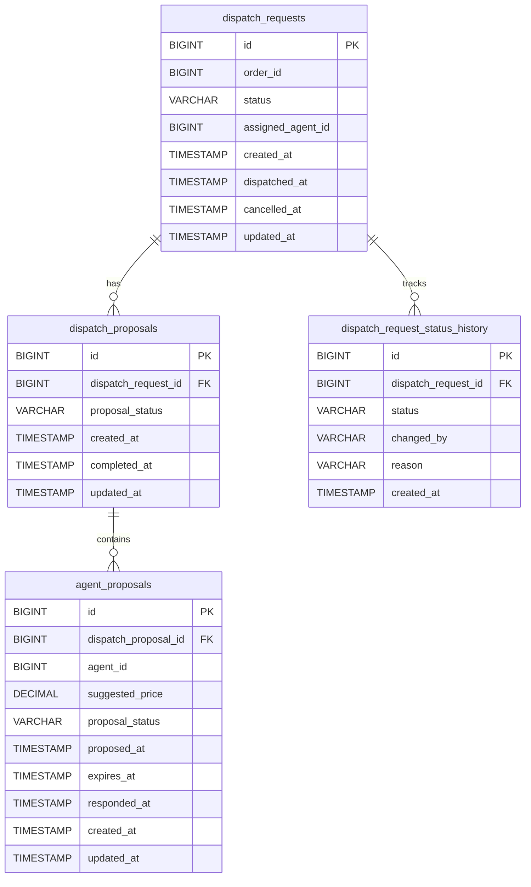

# 배차 서버 ERD 상세 설명

좋아! metadata 제거한 최종 ERD:



## 시스템 개요
음식 배송 서비스의 배차(dispatch) 시스템입니다. 오더가 생성되면 AI 배차 시스템이 적절한 기사(agent)를 추천하고, 기사가 수락하면 배차가 완료됩니다. EDA(Event-Driven Architecture) 기반으로 동작합니다.

---

## 테이블 구조

### 1. dispatch_requests (배차 요청)
**목적**: 오더별 배차 시도의 전체 생명주기를 관리하는 메인 테이블

**컬럼**:
- `id` (BIGINT, PK): 배차 요청 고유 ID
- `order_id` (BIGINT, NOT NULL): 주문 ID (외부 오더 서버 참조)
- `status` (VARCHAR, NOT NULL): 배차 상태
    - `PENDING`: 배차 진행 중
    - `DISPATCHED`: 배차 완료 (기사 수락)
    - `CANCELLED`: 주문 취소로 배차 취소
- `assigned_agent_id` (BIGINT, NULLABLE): 최종 배정된 기사 ID (DISPATCHED 상태일 때만 값 존재)
- `created_at` (TIMESTAMP, NOT NULL): 배차 시작 시각 (오더 생성 이벤트 수신 시각)
- `dispatched_at` (TIMESTAMP, NULLABLE): 배차 완료 시각 (기사 수락 시각)
- `cancelled_at` (TIMESTAMP, NULLABLE): 취소 시각
- `updated_at` (TIMESTAMP, NOT NULL): 마지막 수정 시각

**특징**:
- 한 오더에 대해 배차 실패 후 재배차가 필요하면 새로운 dispatch_request 레코드를 생성합니다
- 기사가 배차 후 취소하면 배송 서버에서 재배차 이벤트를 발행하고, 새로운 dispatch_request가 생성됩니다

**인덱스**:
- `idx_order_id (order_id)`: 특정 오더의 배차 이력 조회
- `idx_status (status)`: 상태별 배차 요청 조회
- `idx_created_at (created_at)`: 시간순 정렬

---

### 2. dispatch_proposals (AI 추천 단위)
**목적**: AI 배차 시스템의 한 번 추천을 나타내는 테이블. AI가 기사를 추천할 때마다 생성됩니다.

**컬럼**:
- `id` (BIGINT, PK): AI 추천 고유 ID
- `dispatch_request_id` (BIGINT, NOT NULL, FK): dispatch_requests 참조
- `proposal_status` (VARCHAR, NOT NULL): 추천 상태
    - `PENDING`: 기사들에게 제안 중
    - `COMPLETED`: 한 명이라도 수락함
    - `CANCELLED`: 모두 거절/타임아웃 또는 주문 취소
- `created_at` (TIMESTAMP, NOT NULL): AI 추천을 받은 시각
- `completed_at` (TIMESTAMP, NULLABLE): 한 명이 수락한 시각
- `updated_at` (TIMESTAMP, NOT NULL): 마지막 수정 시각

**특징**:
- AI가 1명을 추천하면 agent_proposals 1개 생성
- AI가 3명을 동시 추천하면 agent_proposals 3개 생성
- AI의 "배치(batch)" 추천 개념을 명확히 표현

**관계**:
- dispatch_requests (1) : dispatch_proposals (N)
- 한 배차 요청에 여러 번의 AI 추천이 있을 수 있음

**인덱스**:
- `idx_dispatch_request (dispatch_request_id)`: 배차 요청별 추천 조회
- `idx_status (proposal_status)`: 상태별 조회

---

### 3. agent_proposals (기사별 제안)
**목적**: 실제 기사에게 보낸 개별 제안을 관리하는 테이블. 기사별 응답을 추적합니다.

**컬럼**:
- `id` (BIGINT, PK): 기사 제안 고유 ID
- `dispatch_proposal_id` (BIGINT, NOT NULL, FK): dispatch_proposals 참조
- `agent_id` (BIGINT, NOT NULL): 기사 ID (외부 기사 서버 참조)
- `suggested_price` (DECIMAL(10,2), NOT NULL): AI가 제안한 배송료
- `proposal_status` (VARCHAR, NOT NULL): 제안 상태
    - `PENDING`: 제안 중, 기사 응답 대기
    - `ACCEPTED`: 기사 수락
    - `REJECTED`: 기사 거절
    - `TIMEOUT`: 기사 무응답 (expires_at 초과)
    - `CANCELLED`: 제안 취소 (다른 기사가 먼저 수락했거나 주문 취소)
- `proposed_at` (TIMESTAMP, NOT NULL): 기사에게 제안한 시각
- `expires_at` (TIMESTAMP, NOT NULL): 제안 만료 시각 (예: 제안 후 60초)
- `responded_at` (TIMESTAMP, NULLABLE): 기사가 응답한 시각 (수락/거절 시점)
- `created_at` (TIMESTAMP, NOT NULL): 레코드 생성 시각
- `updated_at` (TIMESTAMP, NOT NULL): 마지막 수정 시각

**특징**:
- 한 기사는 동시에 하나의 오더만 제안받을 수 있음 (애플리케이션 레벨에서 제어)
- 동시 제안 시 먼저 수락한 기사가 배차받고, 나머지는 자동으로 CANCELLED

**관계**:
- dispatch_proposals (1) : agent_proposals (N)
- 한 AI 추천에 여러 기사 제안이 포함될 수 있음

**인덱스**:
- `idx_dispatch_proposal (dispatch_proposal_id)`: AI 추천별 기사 제안 조회
- `idx_agent (agent_id)`: 특정 기사의 제안 이력 조회
- `idx_status (proposal_status)`: 상태별 제안 조회
- `idx_expires_at (expires_at)`: 만료된 제안 일괄 처리용

---

### 4. dispatch_request_status_history (배차 상태 이력)
**목적**: 배차 요청의 모든 상태 변경을 추적하는 감사(audit) 테이블

**컬럼**:
- `id` (BIGINT, PK): 이력 레코드 고유 ID
- `dispatch_request_id` (BIGINT, NOT NULL, FK): dispatch_requests 참조
- `status` (VARCHAR, NOT NULL): 변경된 상태 (PENDING, DISPATCHED, CANCELLED)
- `changed_by` (VARCHAR, NULLABLE): 변경 주체
    - 예: `SYSTEM`, `AGENT`, `CUSTOMER`, `ADMIN`
- `reason` (VARCHAR(255), NULLABLE): 변경 이유
    - 예: "오더 생성", "기사 수락", "고객 주문 취소"
- `created_at` (TIMESTAMP, NOT NULL): 상태 변경 시각

**특징**:
- 매 상태 변경마다 레코드 추가 (Append-only)
- 이전 상태는 바로 이전 레코드의 status로 파악 가능
- 디버깅, 감사, 분석 용도

**관계**:
- dispatch_requests (1) : dispatch_request_status_history (N)
- 한 배차 요청의 전체 상태 변경 히스토리

**인덱스**:
- `idx_dispatch_request (dispatch_request_id)`: 특정 배차의 이력 조회
- `idx_status (status)`: 특정 상태로의 전이 이력 조회
- `idx_created_at (created_at)`: 시간순 정렬

---

## 테이블 간 관계 (Relationships)

```
dispatch_requests (1) ──< (N) dispatch_proposals
dispatch_requests (1) ──< (N) dispatch_request_status_history
dispatch_proposals (1) ──< (N) agent_proposals
```

**계층 구조**:
```
dispatch_request (오더의 배차 여정)
  ├── dispatch_proposal (AI의 첫 번째 추천)
  │     ├── agent_proposal (기사 A에게 제안) - REJECTED
  │     └── agent_proposal (기사 B에게 제안) - TIMEOUT
  ├── dispatch_proposal (AI의 두 번째 추천)
  │     └── agent_proposal (기사 C에게 제안) - ACCEPTED ✓
  └── status_history
        ├── PENDING (10:00:00)
        └── DISPATCHED (10:05:30)
```

---

## 주요 비즈니스 플로우

### 플로우 1: 순차 배차 (한 명씩 제안)

```
1. 오더 생성 이벤트 수신
   → dispatch_requests 생성 (status: PENDING)
   → dispatch_request_status_history 생성 (status: PENDING, changed_by: SYSTEM)

2. AI 배차 서버로 "배차 필요" 이벤트 발행

3. AI가 기사 추천 API 호출
   → dispatch_proposals 생성 (proposal_status: PENDING)
   → agent_proposals 생성 (agent_id: 100, status: PENDING)

4. 기사 100에게 푸시 알림 발송

5-A. 기사 거절
   → agent_proposals 업데이트 (status: REJECTED)
   → dispatch_proposals 업데이트 (status: CANCELLED)
   → AI에 "거절" 이벤트 발행
   → AI가 다른 기사 추천 (3번으로 돌아감)

5-B. 기사 수락
   → agent_proposals 업데이트 (status: ACCEPTED)
   → dispatch_proposals 업데이트 (status: COMPLETED)
   → dispatch_requests 업데이트 (status: DISPATCHED, assigned_agent_id: 100)
   → dispatch_request_status_history 생성 (status: DISPATCHED, changed_by: AGENT)
   → "배차 완료" 이벤트 발행 (배송 서버로)
```

---

### 플로우 2: 동시 배차 (여러 명 동시 제안)

```
1-2. (동일)

3. AI가 3명 동시 추천 API 호출
   → dispatch_proposals 생성 1개 (proposal_status: PENDING)
   → agent_proposals 생성 3개
       - (agent_id: 100, status: PENDING)
       - (agent_id: 200, status: PENDING)
       - (agent_id: 300, status: PENDING)

4. 기사 100, 200, 300에게 동시 푸시 알림 발송

5. 기사 200이 먼저 수락 (트랜잭션 처리)
   → dispatch_requests.status = PENDING 체크 후 DISPATCHED로 업데이트
   → agent_proposals(200) 업데이트 (status: ACCEPTED)
   → agent_proposals(100, 300) 업데이트 (status: CANCELLED)
   → dispatch_proposals 업데이트 (status: COMPLETED)
   → 기사 100, 300에게 "다른 기사 수락" 푸시 발송

6. 기사 100이 수락 시도 (늦게 도착)
   → dispatch_requests.status가 이미 DISPATCHED
   → 예외 발생: "이미 다른 기사가 수락했습니다"
```

---

### 플로우 3: 주문 취소

```
배차 진행 중 주문 취소 이벤트 수신:
   → dispatch_requests 업데이트 (status: CANCELLED)
   → 모든 PENDING agent_proposals 업데이트 (status: CANCELLED)
   → dispatch_proposals 업데이트 (status: CANCELLED)
   → dispatch_request_status_history 생성 (status: CANCELLED, changed_by: CUSTOMER)
   → 해당 기사들에게 "주문 취소" 푸시 발송
```

---

### 플로우 4: 기사 배차 후 취소 (재배차)

```
1. 배차 완료 상태 (dispatch_requests.status = DISPATCHED)

2. 배송 서버에서 "기사 취소" 이벤트 발행

3. 배차 서버가 재배차 필요 이벤트 수신
   → 새로운 dispatch_requests 생성 (같은 order_id, status: PENDING)
   → (플로우 1 또는 2로 진행)

참고: 이전 dispatch_requests는 DISPATCHED 상태 유지
     배차 서버는 기사 취소를 직접 기록하지 않음 (배송 도메인 영역)
```

---

## 동시성 제어

### 문제: 여러 기사가 동시에 수락 버튼 클릭

**해결책**: dispatch_requests의 status 필드를 이용한 낙관적 락

```sql
-- 트랜잭션 내에서
UPDATE dispatch_requests
SET status = 'DISPATCHED',
    assigned_agent_id = :agentId,
    dispatched_at = NOW()
WHERE id = :id 
  AND status = 'PENDING';  -- 핵심: 아직 PENDING일 때만 업데이트

-- affected_rows = 0이면 이미 다른 기사가 수락함
```

---

## 데이터 예시

### 시나리오: 오더 ORD-123의 배차 과정

**dispatch_requests**
```
id: 1
order_id: 123
status: DISPATCHED
assigned_agent_id: 300
created_at: 2025-10-14 10:00:00
dispatched_at: 2025-10-14 10:05:30
```

**dispatch_proposals**
```
id: 10, dispatch_request_id: 1, status: CANCELLED, created_at: 10:00:05
id: 11, dispatch_request_id: 1, status: COMPLETED, created_at: 10:02:00
```

**agent_proposals**
```
id: 100, dispatch_proposal_id: 10, agent_id: 100, status: REJECTED, proposed_at: 10:00:05
id: 101, dispatch_proposal_id: 10, agent_id: 200, status: TIMEOUT, proposed_at: 10:00:05
id: 102, dispatch_proposal_id: 11, agent_id: 300, status: ACCEPTED, proposed_at: 10:02:00
```

**dispatch_request_status_history**
```
id: 1, dispatch_request_id: 1, status: PENDING, changed_by: SYSTEM, created_at: 10:00:00
id: 2, dispatch_request_id: 1, status: DISPATCHED, changed_by: AGENT, created_at: 10:05:30
```

**해석**:
- AI가 첫 추천으로 기사 100, 200 제안 → 둘 다 실패
- AI가 재추천으로 기사 300 제안 → 수락
- 총 2번의 AI 추천, 3명의 기사 제안

---

## 주요 쿼리 패턴

### 1. 특정 오더의 최신 배차 상태 조회
```sql
SELECT * FROM dispatch_requests 
WHERE order_id = 123 
ORDER BY created_at DESC 
LIMIT 1;
```

### 2. 배차 진행 중인 요청 조회
```sql
SELECT * FROM dispatch_requests 
WHERE status = 'PENDING';
```

### 3. 특정 기사의 제안 이력
```sql
SELECT ap.*, dp.dispatch_request_id, dr.order_id
FROM agent_proposals ap
JOIN dispatch_proposals dp ON ap.dispatch_proposal_id = dp.id
JOIN dispatch_requests dr ON dp.dispatch_request_id = dr.id
WHERE ap.agent_id = 300
ORDER BY ap.proposed_at DESC;
```

### 4. 만료된 제안 일괄 처리
```sql
UPDATE agent_proposals
SET proposal_status = 'TIMEOUT',
    updated_at = NOW()
WHERE proposal_status = 'PENDING'
  AND expires_at < NOW();
```

### 5. AI 추천별 성공률 분석
```sql
SELECT 
  dp.id,
  COUNT(*) as total_proposals,
  SUM(CASE WHEN ap.proposal_status = 'ACCEPTED' THEN 1 ELSE 0 END) as accepted_count
FROM dispatch_proposals dp
JOIN agent_proposals ap ON dp.id = ap.dispatch_proposal_id
GROUP BY dp.id;
```

---

## 설계 원칙

1. **이벤트 기반**: 오더 서버, AI 배차 서버, 배송 서버와 Kafka 이벤트로 통신
2. **도메인 경계**: 배차 서버는 "배차"까지만 책임. 배송은 배송 서버 영역
3. **3레벨 계층**: request → proposal (AI 추천) → agent_proposal (기사 제안)
4. **유연성**: 1명 제안도, 여러 명 동시 제안도 동일한 구조로 처리
5. **감사 추적**: 모든 상태 변경을 history 테이블에 기록
6. **최소 정보 원칙**: 당장 필요없는 필드는 추가하지 않음 (나중에 추가 가능)